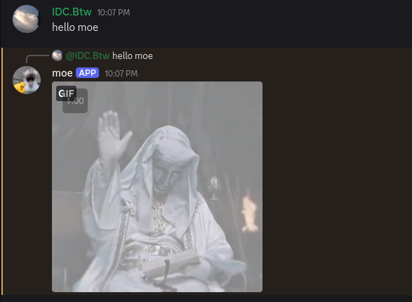
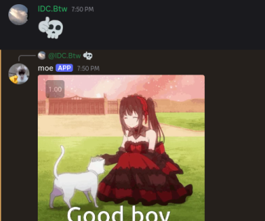

# Evil Moe Discord Bot (Docker Compose Setup)

This guide explains how to set up and run the emoe aka  Evil Moe Discord Bot using Docker and Docker Compose. This method bundles the bot and its Ollama dependency into manageable containers. 

here is some examples of chat 






## Prerequisites

*   **VPS or A local machine :** it can be linux  / windows / mac : takes around 4gb of ram and 6gb of storage . No gpu is needed a cpu with 2 core around 2.5 ghz will be enough and fast. 
*   **Git:** To clone the repository.
*   **Docker & Docker Compose:** Required to build and run the containerized application.
*   **Discord Bot Token:** A secret token needed for the bot to connect to Discord.


### Getting a Discord Bot Token

1.  Go to the [Discord Developer Portal](https://discord.com/developers/applications).
2.  Click "New Application" and give your bot a name.
3.  Navigate to the "Bot" tab on the left sidebar.
4.  Click "Add Bot" and confirm.
5.  Under the bot's username, click "Reset Token" (or "View Token" if visible) and copy the token. **Treat this token like a password - do not share it!**
6.  While you're here, ensure the following **Privileged Gateway Intents** are enabled (required for the bot to read messages):
    *   `PRESENCE INTENT` (May not be strictly needed for this bot, but often useful)
    *   `SERVER MEMBERS INTENT` (May not be strictly needed for this bot, but often useful)
    *   `MESSAGE CONTENT INTENT` (**Required**)
7.  You also need to invite the bot to your server. Go to the "OAuth2" -> "URL Generator" tab. Select the `bot` and `application.commands` scopes. Then, select the necessary Bot Permissions (e.g., `Read Messages/View Channels`, `Send Messages`, `Embed Links`, `Attach Files`). Copy the generated URL and paste it into your browser to invite the bot to your desired server.

## Installation Steps

### 1. Install Docker and Docker Compose

You need both Docker Engine and Docker Compose. Installation varies by operating system:

*   **Windows:** Install **Docker Desktop for Windows**. It includes both Docker Engine and Docker Compose. Follow the official instructions: [https://docs.docker.com/desktop/install/windows-install/](https://docs.docker.com/desktop/install/windows-install/)
*   **macOS:** Install **Docker Desktop for Mac**. It includes both Docker Engine and Docker Compose. Follow the official instructions: [https://docs.docker.com/desktop/install/mac-install/](https://docs.docker.com/desktop/install/mac-install/)
*   **Linux:**
    *   Install **Docker Engine** for your specific distribution. Follow the official instructions: [https://docs.docker.com/engine/install/#server](https://docs.docker.com/engine/install/#server)
    *   Install the **Docker Compose Plugin** (recommended) or standalone `docker-compose`. Follow the official instructions: [https://docs.docker.com/compose/install/linux/](https://docs.docker.com/compose/install/linux/)
    *   Ensure you complete the **post-installation steps** for Linux to run Docker as a non-root user: [https://docs.docker.com/engine/install/linux-postinstall/](https://docs.docker.com/engine/install/linux-postinstall/)

Verify your installation by running `docker --version` and `docker compose version` (or `docker-compose --version` for older standalone installs) in your terminal.

### 2. Clone the Repository

Open your terminal or command prompt and clone the repository:

```bash
git clone https://github.com/aptdnfapt/emoe.git
```

### 3. Navigate to the Directory

Change into the cloned repository's directory:

```bash
cd emoe
```

### 4. Configure `.env` File (Manual Token Input)

The installation script will prompt you for your Discord Bot Token. Make sure you have it ready from the Prerequisites step. The script will automatically update the `.env` file.

*(See the "Configuration Details" section below for explanations of other `.env` variables like replacements).*

### 5. Run the Installation Script

Execute the installation script. This will guide you through the setup process, including entering your Discord Bot Token and downloading the necessary Ollama model.

```bash
./install.sh
```
*(If you get a permission error, run `chmod +x install.sh` first)*

The script will:
*   Check for Docker and Docker Compose.
*   Prompt you for your Discord Bot Token and update the `.env` file.
*   Create necessary placeholder files (`bot_config.json`, `chat_log.jsonl`).
*   Start the Ollama service via Docker Compose.
*   Download the required Ollama model (`hf.co/mradermacher/DialoGPT-large-gavin-GGUF:F16`) inside the Ollama container (this may take time).
*   Build the bot's Docker image (if needed).
*   Start both the bot and Ollama containers.

## How it Works

*   **Docker Compose (`docker-compose.yml`):** Defines and manages two services: `ollama` (running the official Ollama image) and `bot` (built using the `Dockerfile`). It sets up networking so they can communicate and configures automatic restarts (`restart: unless-stopped`).
*   **Dockerfile:** Specifies how to build the Docker image for the Python bot, including installing dependencies from `requirements.txt`.
*   **.env File:** Stores configuration variables like your `DISCORD_BOT_TOKEN` and the `OLLAMA_API_URL` (which points to the Ollama service within the Docker network).
*   **Volumes:** Docker Compose uses volumes to persist data:
    *   `ollama_data`: Stores the downloaded Ollama models, so they aren't lost when the container stops.
    *   `./bot_config.json` & `./chat_log.jsonl`: Links files inside the bot container to files in your `emoe` directory on your host machine, making the bot's configuration and logs persistent.
*   **install.sh:** Automates the setup steps: prerequisite checks, `.env` configuration, placeholder file creation, Ollama model download, and starting the services via `docker-compose up -d`.
*   **uninstall.sh:** Automates cleanup: stops and removes containers, removes the custom bot image, removes the Ollama data volume, removes the base Ollama image, and removes the host config/log files.

## Configuration Details (`.env` File)

The `.env` file controls the bot's core settings and customization.

*   `DISCORD_BOT_TOKEN`: **(Required)** Your unique bot token obtained from the Discord Developer Portal. The `install.sh` script will prompt you for this.
*   `OLLAMA_API_URL`: **(Required for Docker Compose)** Should be set to `http://ollama:11434` to allow the bot container to communicate with the Ollama container service. Do not change this unless you have a custom Docker network setup.
*   `WORD_REPLACEMENTS`: (Optional) Define standard, case-insensitive word or phrase replacements that always happen.
    *   **Format:** Comma-separated pairs of `word_to_find:replacement_word`. No extra spaces around `:` or `,`.
    *   **Example:** `WORD_REPLACEMENTS=gaven:moe,hello there:greetings`
*   `PROBABILISTIC_REPLACEMENTS`: (Optional) Define case-insensitive replacements that happen based on chance.
    *   **Format:** Semicolon-separated rules. Each rule is `target|probability|option1,option2,...`.
        *   `target`: The word/phrase/emoji to find.
        *   `probability`: A number from 0.0 (never) to 1.0 (always) representing the chance of replacement for *each* occurrence found.
        *   `option1,option2,...`: Comma-separated list of possible replacements. One is chosen randomly if the probability check succeeds.
    *   **Example:** `PROBABILISTIC_REPLACEMENTS=💀|0.5|🍆,😘,🦅;👍|0.7|💀` (Replaces 💀 with 🍆, 😘, or 🦅 50% of the time; replaces 👍 with 💀 70% of the time).

## Managing the Bot

*   **View Logs:** `docker-compose logs -f bot` or `docker-compose logs -f ollama`
*   **Stop Services:** `docker-compose down` (run in the `emoe` directory)
*   **Start Services:** `docker-compose up -d` (run in the `emoe` directory)
*   **Update Configuration (`.env`):**
    1.  `docker-compose down`
    2.  Edit the `.env` file.
    3.  `docker-compose up -d`
*   **Uninstall:** Run `./uninstall.sh` from the `emoe` directory.

## hf repo
https://huggingface.co/mradermacher/DialoGPT-large-gavin-GGUF
## Special Thanks:
Emoe was inspired by https://github.com/monk-afk/moe based and made using same model but fine-tuned dialogpt by mradermacher . I call it evil moe because the main model Dialogpt was trained by microsoft on reddit data . But still it doesnt have the reddit bs and caos. Emoe's base model aka DialoGPT-large-gavin was finned tuned to be more like that fashion . And I can promise you that it nailed it . Enjoy . 

# timewaste
